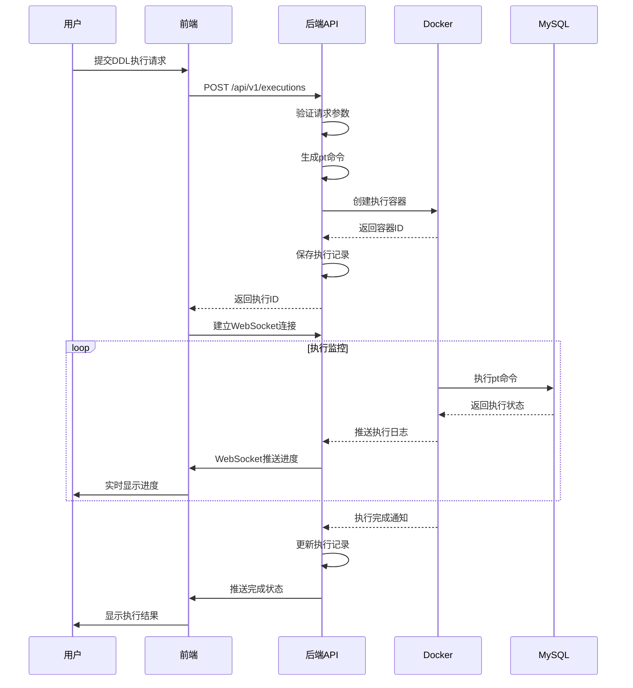
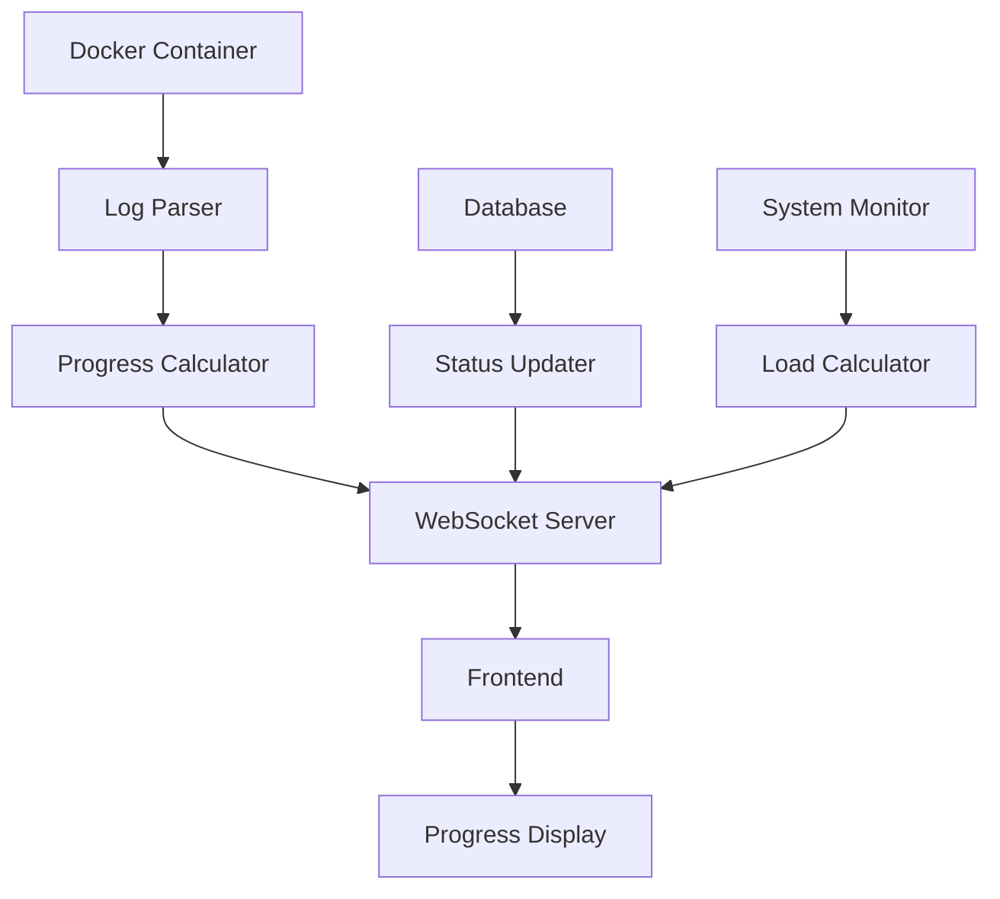
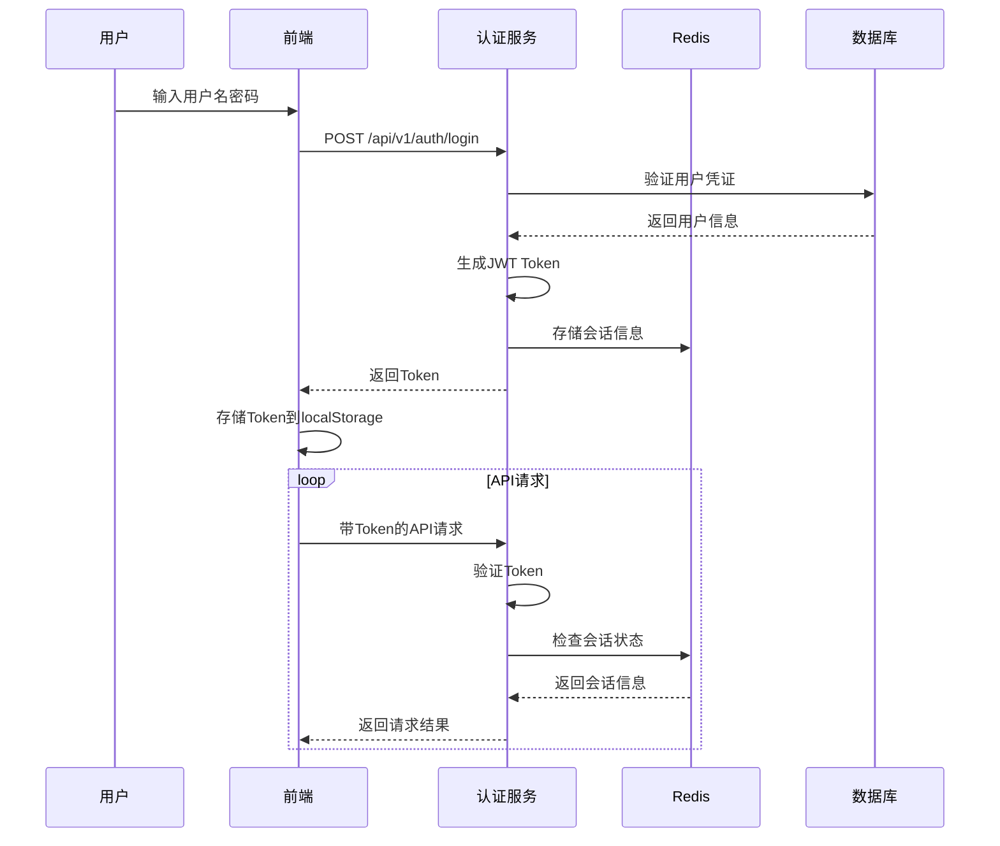

# MySQLer 项目架构设计文档

## 1. 项目概述

MySQLer 是一个基于Web的 pt-online-schema-change 工具管理平台，提供可视化界面来执行MySQL在线表结构变更，避免传统DDL操作的锁表风险。

### 本期MVP架构目标（极简）

- 仅提供后端REST接口（Go + Gin），用于触发/预览 `pt-online-schema-change`。
- 通过宿主 `/var/run/docker.sock` 启动带 percona-toolkit 的临时容器执行命令，回传标准输出/错误与退出码。
- 不接入应用自有 MySQL/Redis；不做历史持久化；不做 WebSocket 实时；不做用户/权限。
- Compose 可选，仅包含后端服务与 docker.sock 只读挂载。

## 2. 技术选型

### 2.1 后端技术栈

| 技术组件 | 版本 | 说明 | 选择理由 |
|---------|------|------|---------|
| **Go** | 1.21+ | 编程语言 | 高性能、并发支持好、部署简单 |
| **Gin** | v1.9+ | Web框架 | 轻量级、高性能、生态丰富 |
| **GORM** | v1.25+ | ORM框架 | Go生态最成熟的ORM |
| **MySQL** | 8.0+ | 主数据库 | 存储执行历史和配置 |
| **Redis** | 7.0+ | 缓存数据库 | 会话存储、实时数据缓存 |
| **Docker** | 20.0+ | 容器化 | pt工具执行环境隔离 |
| **WebSocket** | gorilla/websocket | 实时通信 | 执行进度实时推送 |

### 2.2 前端技术栈

| 技术组件 | 版本 | 说明 | 选择理由 |
|---------|------|------|---------|
| **Vue 3** | 3.3+ | 前端框架 | 组合式API、TypeScript支持好 |
| **TypeScript** | 5.0+ | 编程语言 | 类型安全、开发体验好 |
| **Element Plus** | 2.3+ | UI组件库 | 组件丰富、文档完善 |
| **Vite** | 4.0+ | 构建工具 | 快速热更新、现代化构建 |
| **Pinia** | 2.1+ | 状态管理 | Vue 3官方推荐 |
| **Axios** | 1.4+ | HTTP客户端 | 功能完善、拦截器支持 |

### 2.3 基础设施

| 组件 | 说明 | 用途 |
|------|------|------|
| **Docker Compose** | 容器编排 | 本地开发和部署 |
| **Nginx** | 反向代理 | 生产环境负载均衡 |
| **Percona Toolkit** | pt工具集 | DDL执行核心工具 |

## 3. 系统架构

### 3.1 整体架构图

```
┌─────────────────────────────────────────────────────────────┐
│                        Client Layer                         │
├─────────────────────────────────────────────────────────────┤
│  Web Browser  │  Mobile Browser  │  API Client             │
└─────────────────────────────────────────────────────────────┘
                            │
                            │ HTTPS/WSS
                            ▼
┌─────────────────────────────────────────────────────────────┐
│                      Gateway Layer                          │
├─────────────────────────────────────────────────────────────┤
│                     Nginx (Prod)                           │
│              ┌─────────────────────┐                       │
│              │  SSL Termination    │                       │
│              │  Load Balancing     │                       │
│              │  Static File Serve  │                       │
│              └─────────────────────┘                       │
└─────────────────────────────────────────────────────────────┘
                            │
                            ▼
┌─────────────────────────────────────────────────────────────┐
│                    Application Layer                        │
├─────────────────────────────────────────────────────────────┤
│                  MySQLer Web App (Go)                      │
│  ┌─────────────┐ ┌─────────────┐ ┌─────────────┐           │
│  │    REST     │ │  WebSocket  │ │    Auth     │           │
│  │     API     │ │   Server    │ │  Middleware │           │
│  └─────────────┘ └─────────────┘ └─────────────┘           │
│  ┌─────────────┐ ┌─────────────┐ ┌─────────────┐           │
│  │ Connection  │ │ Execution   │ │   System    │           │
│  │  Manager    │ │   Engine    │ │  Manager    │           │
│  └─────────────┘ └─────────────┘ └─────────────┘           │
└─────────────────────────────────────────────────────────────┘
                     │               │
                     ▼               ▼
┌────────────────────────┐ ┌─────────────────────────┐
│    Storage Layer       │ │   Execution Layer       │
├────────────────────────┤ ├─────────────────────────┤
│  ┌─────────────────┐   │ │  ┌───────────────────┐  │
│  │     MySQL       │   │ │  │  Docker Engine    │  │
│  │  ┌───────────┐  │   │ │  │ ┌───────────────┐ │  │
│  │  │ App Data  │  │   │ │  │ │ PT Container 1│ │  │
│  │  │ User Info │  │   │ │  │ │ PT Container 2│ │  │
│  │  │ Exec Logs │  │   │ │  │ │ PT Container N│ │  │
│  │  └───────────┘  │   │ │  │ └───────────────┘ │  │
│  └─────────────────┘   │ │  └───────────────────┘  │
│                        │ │                         │
│  ┌─────────────────┐   │ │  ┌───────────────────┐  │
│  │     Redis       │   │ │  │  Target MySQL     │  │
│  │  ┌───────────┐  │   │ │  │ ┌───────────────┐ │  │
│  │  │ Sessions  │  │   │ │  │ │ Database 1    │ │  │
│  │  │ Cache     │  │   │ │  │ │ Database 2    │ │  │
│  │  │ RT Data   │  │   │ │  │ │ Database N    │ │  │
│  │  └───────────┘  │   │ │  │ └───────────────┘ │  │
│  └─────────────────┘   │ │  └───────────────────┘  │
└────────────────────────┘ └─────────────────────────┘
```

### 3.2 模块架构

#### 3.2.1 前端模块结构
```
src/
├── components/           # 通用组件
│   ├── common/          # 基础组件
│   ├── forms/           # 表单组件
│   ├── charts/          # 图表组件
│   └── layout/          # 布局组件
├── views/               # 页面视图
│   ├── auth/           # 认证页面
│   ├── connections/    # 连接管理
│   ├── execution/      # DDL执行
│   ├── history/        # 执行历史
│   └── system/         # 系统管理
├── stores/              # Pinia状态管理
│   ├── auth.ts         # 认证状态
│   ├── connections.ts  # 连接状态
│   └── execution.ts    # 执行状态
├── services/            # API服务
│   ├── api.ts          # API基础配置
│   ├── auth.ts         # 认证API
│   ├── connections.ts  # 连接API
│   └── execution.ts    # 执行API
├── utils/               # 工具函数
├── types/               # TypeScript类型定义
└── router/              # 路由配置
```

#### 3.2.2 后端模块结构
```
cmd/
└── server/
    └── main.go          # 应用入口

internal/
├── config/              # 配置管理
│   ├── config.go       # 配置结构
│   └── database.go     # 数据库配置
├── models/              # 数据模型
│   ├── connection.go   # 连接模型
│   ├── execution.go    # 执行记录模型
│   └── user.go         # 用户模型
├── services/            # 业务逻辑层
│   ├── auth_service.go # 认证服务
│   ├── conn_service.go # 连接服务
│   ├── exec_service.go # 执行服务
│   └── docker_service.go # Docker服务
├── handlers/            # HTTP处理器
│   ├── auth_handler.go # 认证处理
│   ├── conn_handler.go # 连接处理
│   ├── exec_handler.go # 执行处理
│   └── ws_handler.go   # WebSocket处理
├── middleware/          # 中间件
│   ├── auth.go         # 认证中间件
│   ├── cors.go         # CORS中间件
│   └── logging.go      # 日志中间件
├── utils/               # 工具函数
│   ├── crypto.go       # 加密工具
│   ├── docker.go       # Docker工具
│   └── validator.go    # 验证工具
└── database/            # 数据库操作
    ├── migrations/     # 数据库迁移
    └── seeders/        # 测试数据
```

## 4. 数据流设计

### 4.1 DDL执行流程



### 4.2 实时监控数据流



## 5. 安全架构

### 5.1 认证授权流程



### 5.2 数据加密策略

| 数据类型 | 加密方式 | 密钥管理 |
|---------|---------|---------|
| 数据库密码 | AES-256-GCM | 环境变量配置 |
| 用户密码 | bcrypt | 内置salt |
| JWT Token | HMAC-SHA256 | 随机生成密钥 |
| 传输数据 | TLS 1.2+ | SSL证书 |

## 6. 性能设计

### 6.1 并发处理策略

```go
// 执行队列设计
type ExecutionQueue struct {
    maxConcurrency int
    running        map[string]*Execution
    pending        chan *ExecutionRequest
    mutex          sync.RWMutex
}

// 资源池管理
type DockerPool struct {
    containers map[string]*Container
    available  chan string
    maxSize    int
}
```

### 6.2 缓存策略

| 缓存类型 | 存储方式 | 过期时间 | 更新策略 |
|---------|---------|---------|---------|
| 用户会话 | Redis | 24小时 | 主动刷新 |
| 连接信息 | 内存+Redis | 1小时 | 写入时更新 |
| 执行状态 | Redis | 7天 | 实时更新 |
| 静态资源 | Nginx | 30天 | 版本控制 |

### 6.3 数据库优化

```sql
-- 索引设计示例
CREATE INDEX idx_execution_status ON execution_records(status, created_at);
CREATE INDEX idx_execution_table ON execution_records(database_name, table_name);
CREATE INDEX idx_audit_user_action ON audit_logs(user_id, action, created_at);

-- 分区表设计（执行记录按月分区）
ALTER TABLE execution_records PARTITION BY RANGE (YEAR(created_at)*100 + MONTH(created_at));
```

## 7. 容器化设计

### 7.1 Docker镜像设计

```dockerfile
# 多阶段构建示例
FROM golang:1.21-alpine AS builder
WORKDIR /app
COPY go.mod go.sum ./
RUN go mod download
COPY . .
RUN CGO_ENABLED=0 GOOS=linux go build -o main cmd/server/main.go

FROM registry-harbor.yafex.cn/base/percona-server:5.7v6
RUN apt-get update && apt-get install -y percona-toolkit
COPY --from=builder /app/main /app/main
COPY --from=builder /app/web/dist /app/web/dist
EXPOSE 8080
CMD ["/app/main"]
```

### 7.2 容器编排

```yaml
# docker-compose.yml 关键配置
version: '3.8'
services:
  app:
    build: .
    ports:
      - "8080:8080"
    environment:
      - DB_HOST=mysql
      - REDIS_HOST=redis
      - DOCKER_HOST=unix:///var/run/docker.sock
    volumes:
      - /var/run/docker.sock:/var/run/docker.sock:ro
    deploy:
      resources:
        limits:
          cpus: '2.0'
          memory: 2G
    restart: unless-stopped
    
  mysql:
    image: mysql:8.0
    environment:
      MYSQL_ROOT_PASSWORD: ${MYSQL_ROOT_PASSWORD}
    volumes:
      - mysql_data:/var/lib/mysql
    
  redis:
    image: redis:7-alpine
    volumes:
      - redis_data:/data
```

## 8. 监控与日志

### 8.1 应用监控指标

```go
// Prometheus指标定义
var (
    executionTotal = prometheus.NewCounterVec(
        prometheus.CounterOpts{
            Name: "executions_total",
            Help: "Total number of executions",
        },
        []string{"status", "database"},
    )
    
    executionDuration = prometheus.NewHistogramVec(
        prometheus.HistogramOpts{
            Name: "execution_duration_seconds",
            Help: "Execution duration in seconds",
        },
        []string{"database", "table"},
    )
)
```

### 8.2 日志架构

```go
// 结构化日志配置
type Logger struct {
    *logrus.Logger
    requestID string
    userID    string
}

// 日志格式示例
{
    "timestamp": "2024-01-15T10:30:00Z",
    "level": "info",
    "msg": "DDL execution started",
    "request_id": "req-123456",
    "user_id": "user-789",
    "execution_id": "exec-abc123",
    "database": "test_db",
    "table": "test_table",
    "operation": "add_column"
}
```

## 9. 部署方案

### 9.1 开发环境
```bash
# 快速启动开发环境
docker-compose -f docker-compose.dev.yml up -d
```

### 9.2 生产环境
```bash
# 生产环境部署
docker-compose -f docker-compose.prod.yml up -d
# 配置Nginx反向代理
# 配置SSL证书
# 配置监控告警
```

### 9.3 扩展方案
- **水平扩展**: 多实例负载均衡
- **垂直扩展**: 容器资源调整
- **数据库扩展**: 读写分离、分库分表

## 10. 技术债务和改进计划

### 10.1 已知限制
- Docker依赖: 需要Docker环境支持
- 单实例限制: 当前不支持分布式部署
- 内存使用: 大表操作内存占用较高

### 10.2 后续优化
1. **Phase 2**: 支持Kubernetes部署
2. **Phase 3**: 实现分布式执行
3. **Phase 4**: 增加更多数据库支持

---

**文档版本**: v1.0  
**创建时间**: 2024-01-15  
**维护人员**: 开发团队